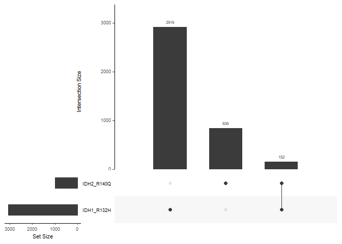
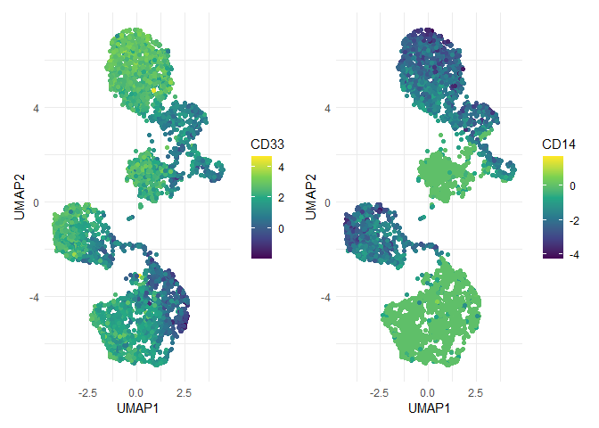

<!-- README.md is generated from README.Rmd. Please edit that file -->

# tapestri.tools

<!-- badges: start -->
<!-- badges: end -->

A toolbox for the analysis of MissionBio’s tapestri single cell
multi-omics data.

## Installation

You can install the development version of tapestri.tools from
[GitHub](https://github.com/) with:

``` r
# install.packages("devtools")
devtools::install_github("northNomad/tapestri.tools")
```

## Read all the DNA variants

``` r
#Load tapestri multi-omics data stored in .h5 format into session
h5f <- tapestri.tools::read_h5(path = "data_private/mpdxD-18_MB_33_38.dna+protein.h5")

dt_variants <- get_variants(h5f = h5f, format = "data.table")
head(dt_variants)
#>    ALT CHROM       POS             QUAL REF ado_gt_cells ado_rate
#> 1:   A  chr1 115256513   44855.19921875   G           -1       -1
#> 2:   A  chr1 115256514 597.070007324219   G           -1       -1
#> 3:   T  chr1 115256515 570.809997558594   C           -1       -1
#> 4:   G  chr1 115256516             1436   A           -1       -1
#> 5:   T  chr1 115256516             1436   A           -1       -1
#> 6:   T  chr1 115256517  1098.0400390625   C           -1       -1
#>                 amplicon filtered                 id SYMBOL
#> 1: AML_v2_NRAS_115256512       00 chr1:115256513:G/A   NRAS
#> 2: AML_v2_NRAS_115256512       01 chr1:115256514:G/A   NRAS
#> 3: AML_v2_NRAS_115256512       01 chr1:115256515:C/T   NRAS
#> 4: AML_v2_NRAS_115256512       01 chr1:115256516:A/G   NRAS
#> 5: AML_v2_NRAS_115256512       01 chr1:115256516:A/T   NRAS
#> 6: AML_v2_NRAS_115256512       01 chr1:115256517:C/T   NRAS
```

## `tapestri.tools` data wrangling

In the example experiment, we transplanted a mix of two primary AML
samples into one immunodeficient mice.

12 weeks after transplantation, we harvested the bone marrow cells and
performed single cell DNA + protein sequencing using MissionBio’s
tapestri platform. One of the AML sample carries IDH1<sup>R132H</sup>
mutation, the other carries IDH2<sup>R140Q</sup>; we know these two
*IDH* variants are mutually exclusive.

``` r
#based on hg19
int_variants <- c(IDH1_R132H = "chr2:209113112:C/T", IDH2_R140Q = "chr15:90631934:C/T")

tapestri.tools::plot_upset_with_variants(h5f, variants = int_variants, unknown = "unknown_to_ref")
#> Warning in if (format == "GRanges") {: the condition has length > 1 and only the
#> first element will be used
#> Warning in if (format == "list") {: the condition has length > 1 and only the
#> first element will be used
```



### Filter or index the cells based on the genotypes of specific variants:

``` r
#which cells carry IDH1 mutation? 
index_cells_IDH1 <- get_cells_index(h5f, variants = int_variants[1], int_ngt = c(1, 2)) 

#which cells carry IDH2 mutation?
index_cells_IDH2 <- get_cells_index(h5f, variants = int_variants[2], int_ngt = c(1, 2))

#which cells are doublets 
x <- get_cells_index(h5f, variants = int_variants, int_ngt = c(1, 2)) 
index_doublets <- intersect(x$IDH1_R132H, x$IDH2_R140Q)

####
index_cells_IDH1 <- index_cells_IDH1[!(index_cells_IDH1 %in% index_doublets)]
index_cells_IDH2 <- index_cells_IDH2[!(index_cells_IDH2 %in% index_doublets)]

length(index_cells_IDH1) #2919
#> [1] 2919
length(index_cells_IDH2) #839
#> [1] 839
```

### Read in genotype matrix of FLT3ITD variants of IDH1 mutated cells

``` r
FLT3ITD <- get_flt3itd(h5f, format = "data.table")
FLT3ITD
#>                                                ALT CHROM      POS
#>  1: TAAATTTTCTCTTGGAAACTCCCATTTGAGATCATATTCATATTTC chr13 28608226
#>  2: TCCCATTTGAGATCATATTCATATTTCAAATTTTCTCTTGGAAACA chr13 28608245
#>  3: ATTTGAGATCATATTCATATTTCAAATTTTCTCTTGGAAACTCCCC chr13 28608249
#>  4: TTTGAGATCATATTCATATTTCAAATTTTCTCTTGGAAACTCCCAC chr13 28608250
#>  5: TTGAGATCATATTCATATTTCAAATTTTCTCTTGGAAACTCCCATC chr13 28608251
#>  6: ATCATATTCATATTTCAAATTTTCTCTTGGAAACTCCCATTTGAGG chr13 28608256
#>  7:                         TTCATATTCTCTGAAATCAACG chr13 28608262
#>  8: TTCATATTTCAAATTTTCTCTTGGAAACTCCCATATGAGATCATAC chr13 28608262
#>  9:                         TTCTCTGAAATCAACGTCATAC chr13 28608268
#> 10:                          TCAAATTTTCTCTTGGAAACT chr13 28608269
#> 11:                       TCAAATTTTCTCTTGGAAACTCCC chr13 28608269
#> 12:                          TCAAATTTTCTCTTGGACACT chr13 28608269
#> 13:                         TCTGAAATCAACGTCATATTCA chr13 28608271
#> 14:                         AAATCAACGTCATATTCTCTGG chr13 28608275
#> 15:                         ATCAACGTCATATTCTCTGAAG chr13 28608277
#> 16:                                   TACCAAACTCTA chr13 28608278
#> 17:                                        AAACTCT chr13 28608280
#> 18:                                         CATATT chr13 28608284
#>                 QUAL REF ado_gt_cells ado_rate             amplicon filtered
#>  1:  6965.7001953125   T           -1       -1 AML_v2_FLT3_28608210       01
#>  2: 2604.65991210938   T           -1       -1 AML_v2_FLT3_28608210       01
#>  3: 2138.34008789062   A           -1       -1 AML_v2_FLT3_28608210       01
#>  4: 4343.85986328125   T           -1       -1 AML_v2_FLT3_28608210       01
#>  5: 2018.66003417969   T           -1       -1 AML_v2_FLT3_28608210       01
#>  6: 2250.61010742188   A           -1       -1 AML_v2_FLT3_28608210       01
#>  7:           149234   T           -1       -1 AML_v2_FLT3_28608210       00
#>  8:           149234   T           -1       -1 AML_v2_FLT3_28608210       01
#>  9:  2666.0400390625   T           -1       -1 AML_v2_FLT3_28608210       01
#> 10:            10000   .           -1       -1 AML_v2_FLT3_28608210       01
#> 11:            10000   .           -1       -1 AML_v2_FLT3_28608210       01
#> 12:            10000   .           -1       -1 AML_v2_FLT3_28608210       01
#> 13: 1070.93005371094   T           -1       -1 AML_v2_FLT3_28608210       01
#> 14: 1530.15002441406   A           -1       -1 AML_v2_FLT3_28608210       01
#> 15: 1086.83996582031   A           -1       -1 AML_v2_FLT3_28608210       01
#> 16:            10000   .           -1       -1 AML_v2_FLT3_28608210       01
#> 17:  11546.099609375   A           -1       -1 AML_v2_FLT3_28608210       01
#> 18:            10000   .           -1       -1 AML_v2_FLT3_28608210       01
#>                                                                  id SYMBOL
#>  1: chr13:28608226:T/TAAATTTTCTCTTGGAAACTCCCATTTGAGATCATATTCATATTTC   FLT3
#>  2: chr13:28608245:T/TCCCATTTGAGATCATATTCATATTTCAAATTTTCTCTTGGAAACA   FLT3
#>  3: chr13:28608249:A/ATTTGAGATCATATTCATATTTCAAATTTTCTCTTGGAAACTCCCC   FLT3
#>  4: chr13:28608250:T/TTTGAGATCATATTCATATTTCAAATTTTCTCTTGGAAACTCCCAC   FLT3
#>  5: chr13:28608251:T/TTGAGATCATATTCATATTTCAAATTTTCTCTTGGAAACTCCCATC   FLT3
#>  6: chr13:28608256:A/ATCATATTCATATTTCAAATTTTCTCTTGGAAACTCCCATTTGAGG   FLT3
#>  7:                         chr13:28608262:T/TTCATATTCTCTGAAATCAACG   FLT3
#>  8: chr13:28608262:T/TTCATATTTCAAATTTTCTCTTGGAAACTCCCATATGAGATCATAC   FLT3
#>  9:                         chr13:28608268:T/TTCTCTGAAATCAACGTCATAC   FLT3
#> 10:                          chr13:28608269:./TCAAATTTTCTCTTGGAAACT   FLT3
#> 11:                       chr13:28608269:./TCAAATTTTCTCTTGGAAACTCCC   FLT3
#> 12:                          chr13:28608269:./TCAAATTTTCTCTTGGACACT   FLT3
#> 13:                         chr13:28608271:T/TCTGAAATCAACGTCATATTCA   FLT3
#> 14:                         chr13:28608275:A/AAATCAACGTCATATTCTCTGG   FLT3
#> 15:                         chr13:28608277:A/ATCAACGTCATATTCTCTGAAG   FLT3
#> 16:                                   chr13:28608278:./TACCAAACTCTA   FLT3
#> 17:                                        chr13:28608280:A/AAACTCT   FLT3
#> 18:                                         chr13:28608284:./CATATT   FLT3
```

``` r
id_FLT3ITD <- FLT3ITD$id
names(id_FLT3ITD) <- paste0("FLT3ITD", 1:length(id_FLT3ITD))

read_assays_variants(h5f, 
                     included_assays = c("AF", "NGT"),
                     index_variants = get_variants_index(h5f, id_FLT3ITD),
                     index_cells = index_cells_IDH1,  
                     format = "list") -> x

names(x) #AF, NGT
#> [1] "AF"  "NGT"
dim(x$AF)
#> [1]   18 2919
```

## Protein UMAPs

``` r
get_protein_ids(h5f)
#>  [1] "CD11b"  "CD14"   "CD19"   "CD3"    "CD33"   "CD34"   "CD38"   "CD45"  
#>  [9] "CD45RA" "CD90"
```

``` r
dt_protein <- read_protein_counts(h5f, normalization = "clr", transpose = TRUE) %>% as.data.frame() 

umap_protein <- umap::umap(dt_protein)
umap_protein <- cbind(umap_protein$data, as.data.frame(umap_protein$layout))

#
ls_umap <- list()
for(i in get_protein_ids(h5f)){
  ggplot(umap_protein, aes_string("V1", "V2", color = i)) + 
    geom_point() + 
    theme_minimal() + 
    labs(x = "UMAP1", y = "UMAP2") +
    scale_color_viridis_c() -> p
  
  ls_umap[[i]] <- p
}
#
library(patchwork)
ls_umap[["CD33"]] + ls_umap[["CD14"]]
```


….More plotting and filtering functions to come…
